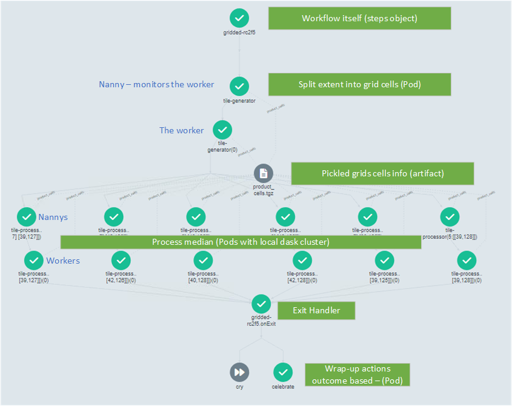

# Sample Argo workflow – Gridded median   <!-- markdownlint-disable MD033 -->

_Note:_ The sample argo workflows are provided as an pattern only and will _not_ run without modifiction for the specific deployment environment - specifically service accounts, aws account numbers and available docker images and versions. For standard EASI deployment environments there are a series of `# TODO` comments which mark the places where modification is usually required.

## Use-case

The [sample `Argo` gridded workflow](../workflows/gridded/easi-wf-gridded-full.yaml) demonstrates how
to run a computationally intensive algorithm such as monthly median calculations on a
potentially large spatiotemporal data cube. The workflow illustrates how to combine
`Argo` and a local `Dask` cluster to perform such a task.

## Workflow overview

The workflow has two main steps consisting of tile generation, which breaks down the
spatial extent into tiles that can be distributed to individual workers running on
separate `Kubernetes` nodes; and tile processing, during which each worker creates a
local `Dask` cluster to calculate geomedians on a handful of tiles.



*Figure 1: Full Argo workflow*

## Workflow details

### Gridded

The first step is the `Argo` steps object in charge of running the rest and is the root of the workflow itself.

### Tile generator

The extent provided by the user as input to the `Argo` workflow is gridded into`Datacube` `GridWorkflow` cells indexed by keys by a [TileGenerator](../tasks/gridded/tile_generator.py). The cell specification is defined by a `GridSpec` setting out the size of cells and coordinates of the keys which identify them. The `DataCube` is queried for `datasets` but no data is loaded. The cells contain metadata allowing direct subsequent data cube loading without searching the index again which saves repeat database queries and excessive load when the workflow fans out to many workers.

The list of cells are pickled into an `Argo artifact` called `product_cells.pickle` which will be shared with all tile processors. `Artifact`s are the best way to pass non-trivial objects (>256KB) between steps, by storing data to file (compressed to `.tgz` by default). In our example, the keys identifying the cells are divided into sub-lists each containing at most `tiles_per_cluster` cells, and each sub-list will be processed by a distinct tile processor.

Using `tiles_per_cluster=2` there are 2 keys in each sub list, each key being a pair of values, e.g.,
```
    keys: [
        [[24, -65], [25, -65]],
        [...],
    ]
```
### Tile processor

The next step in the `Argo` workflow uses a loop around the keys produced by the tile generator, as indicated by the `withParam` instruction. It means `Argo` will start as many [TileProcessor](../tasks/gridded/tile_processor.py) pods as key sub-lists.

Each tile processor runs in its own `Kubernetes` pod and starts a local `Dask cluster` - this requires the `Pod` `requests` and `limits` to be large enough to perform the complete calculation. Once done, it sequentially processes each key inside its assigned sub-list. The data is loaded using `Datacube` by passing the cell metadata retrieved from the`product_cells.pickle` artifact - this already contains the list of `datasets` required so no database query is performed. In this example, each dataset is then split in monthly data and a median is calculated and stored to local disk as `COG` files before being uploaded to an `S3` destination. The median output is a `datacube` so additional metadata is also created to support subsequent indexing into the ODC via another workflow.

On completion, the pod closes its `Dask cluster` and then disappears.

### Wrap-up steps

The last portion of the `Argo` workflow is to perform any wrap-up action. The `onExit` step manages this process, directing the workflow either to the `Celebrate` step on success or `Cry` if any previous `Argo` step failed. In this example, these final steps take no action, but they could be used to clean up any resource left open, should that be the case or to collate information to report on the outcomes of the entire workflow.

## Workflow dynamics

The `tiles_per_worker` and `parallelism` have a significant impact on the length of execution of a `tile-processor` step and how many of them execute in parallel. It is tempting to simply have as many `tile-processors` as there are tiles as this would provide the fastest execution time with a `tile-processor` step execution being the limiting factor. In practice it is more complex as the each `tile-processor` requires a `Pod` to start and stop, and potentially a `Node` to be added to the cluster, start, pull an image and later shutdown. If the execution of a `tile-processor` step is shorter than this overhead of `Pod` and `Node` initialisation then those steps will be delayed signficantly waiting for resources. Even if `Nodes` are already running and ready for use so a `Pod` can be scheduled immediately, there are overheads and costs assocaited with a `Node` shutting down. They commonly remain available, but idle, for a period of time in case another workload begins (in default EASI configurations this is approx 10 minutes). The lack of instant on/off means the workflow `tiles_per_worker` and `parallelism` should be adjusted to achieve the optimimum configuration for a given cost and time efficiency, something that is very use dependent.

## Workflow Design Patterns

### Directory structure
The directory layout has the following pattern:
  1. `docs/gridded` - documentation on the workflow and its use
  1. `tasks/gridded` - the python library that provides the two primary `tasks` performed by the workflow:
  1. `tile_generator.py` - `generates_tiles()` queries the Open Data Cube to find all datasets that intersect a tile (the library used, `GridWorkflow` refers to these as cells rather than tiles for historical reasons). This list of Tiles is then batched into smaller groups for processing.
    1. `tile_processor.py` - `process_tile()` takes a batch list of Tiles and loops through them one by one (dataset loading, masking, scaling, median calculation, save result and create ODC metadata ready for ODC indexing). The `TileProcessor` class has a single `dask.LocalCluster` initialised and includes `configure_s3_access(aws_unsigned=False, requester_pays=True, client=self._client)` to ensure workers have the correct authorisation for the chosen data source (e.g., for USGS landsat `requester_pays=True`)
  1. `workflows/easi-wf-gridded-full.yaml` - The Argo `Workflow` specification for the `gridded-` workflow.

### Workflow Specification

The `Workflow` includes the following design patterns:

  * `metadata.labels` for `owner` identification. It is generally a good idea to include metadata like versioning, who ran the workflow, production or development, etc. `labels` can be used as search criteria to filter the workflow list or by team to identify ownership of running or archived workflows.
  * `spec.onExit` and exit handler is defined that will always run regardless of failures earlier in the workflow - use to clean up resources an provide reports (good or bad).
  * `spec.parallelism` defines the number of steps that can run simultaneously.
  * `templates.steps` all `templates` in this `Workflow` are __idempotent__ - the step can be applied many times, without changing the result. This means they can retry if there is a failure. Strictly speaking they aren't _without change_ - if the source data changes the results will be different; if the calculation is expensive you probably don't want to repeat an entire batch of Tiles if only 1 failed. See [Architecting Workflows for reliability](https://blog.argoproj.io/architecting-workflows-for-reliability-d33bd720c6cc) for additional information on how to improve the example for production workflows.
  * `retryStrategy` and `activeDeadlineSeconds` is includes on each task `template` and configured for the expected behaviour (e.g., complete in 5 minutes) and a number of times to retry before failing the step. The workflow is thus defensive regarding its intended outcome in the event of any number of failure types, including those from the outside (e.g., a Cloud data centre outage).
  * Task `templates` contain `resources` specifications for CPU, memory, etc. This assures tasks are executed on appropriate compute nodes and `limits` defend against abarrent behaviours which might impact other Pods running on the Node.

### `initContainers` and _git-sync_ pattern

Executing a task `template` requires both an `image` containing the computing environment and a `script` to run the actual tasks, in this case the `tile_generator.py` and `tile_processor.py` steps. In general, and especially during development, the `image` tends to change infrequently and takes a significant time to build when changes occur. The `script` tends to be altered more frequently and is quite small to retrieve at runtime. The `Workflow` exploits this behaviour using an `initContainer` with a very lightweight `git_image` which can retrieve the required git repository, on a specific branch, and make the python available for use at runtime in the main `script` container. This significantly improves development and versioning for tasks. The `Workflow.spec.arguments.paremeters.{package-repo, package-branch, package-path, package-secret}` allow the repo and branch/reference to be selected at time of submission.

