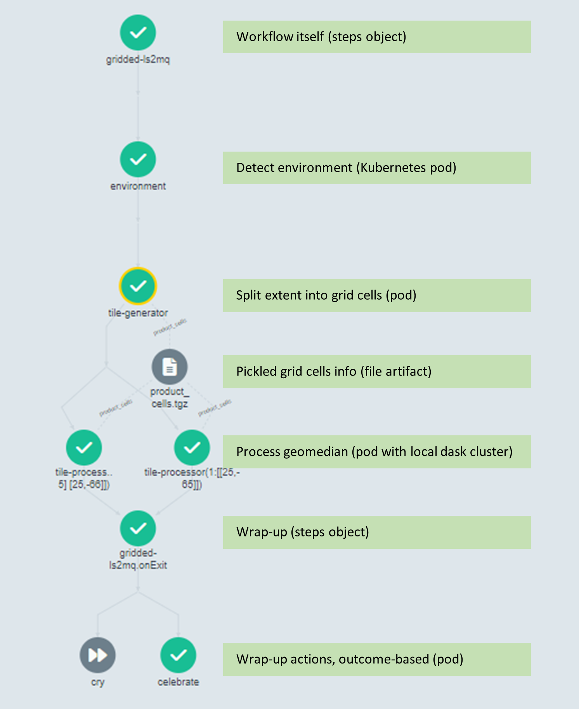

# Sample Argo workflow – Gridded geomedian   <!-- markdownlint-disable MD033 -->

## Use-case

The [sample `Argo` gridded workflow](../workflows/easi-wf-gridded.yaml) demonstrates how
to run a computationally intensive algorithm such as monthly geomedian calculations on a
potentially large spatiotemporal data cube. The workflow illustrates how to combine
`Argo` and a local `Dask` cluster to perform such a task.

> D. Roberts, N. Mueller and A. Mcintyre, "High-Dimensional Pixel Composites From Earth
> Observation Time Series," in IEEE Transactions on Geoscience and Remote Sensing, vol.
> 55, no. 11, pp. 6254-6264, Nov. 2017, doi: 10.1109/TGRS.2017.2723896.

## Workflow overview

The workflow has two main steps consisting of tile generation, which breaks down the
spatial extent into tiles that can be distributed to individual workers running on
separate `Kubernetes` nodes; and tile processing, during which each worker creates a
local `Dask` cluster to calculate geomedians on a handful of tiles.


*Figure 1: Full Argo workflow*

## Workflow details

### Gridded

The first step is the `Argo` steps object in charge of running the rest and can be seen
as the workflow itself.

### Environment

This (optional) step runs in a `Kubernetes` pod and uses EASI utilities to detect the environment e.g., information about the AWS region and artifact storage locations. Alternately, you can simply specify these as parameters on the workflow rather than using the baked in EASI utilities that only support specific environments.

### Tile generator

The extent provided by the user as input to the `Argo` workflow is gridded into`Datacube` `GridWorkflow` cells indexed by keys by a[TileGenerator](../tasks/gridded/tile_generator.py). The cells contain metadata allowingdirect subsequent data cube loading without searching the index again which saves repeat database queries and excessive load when the workflow fans out to many workers.

They are pickled into an `Argo artifact` called `product_cells.pickle` which will be shared with all tile processors. `Artifact`s are the best way to pass non-trivial objects (>256KB) between steps, by storing data to file (compressed to `.tgz` by default). In our example, the keys identifying the cells are divided into sub-lists each containing at most tiles_per_cluster` cells, and each sub-list will be processed by a distinct tile processor.

Using `tiles_per_cluster=2` there are 2 keys in each sub list, each key being a pair of values, e.g.,
```
    keys: [
        [[24, -65], [25, -65]],
        [...],
    ]
```
### Tile processor

The next step in the `Argo` workflow uses a loop around the keys produced by the tile generator, as indicated by the `withParam` instruction. It means `Argo` will start as many [TileProcessor](../tasks/gridded/tile_processor.py) pods as key sub-lists.

Each tile processor runs in its own `Kubernetes` pod and starts a local `Dask cluster`.Once done, it sequentially processes each key inside its assigned sub-list. The actualdata is loaded using `Datacube` by passing the cell metadata retrieved from the`product_cells.pickle` artifact. In this example, each dataset is then split in monthlydata and geomedians get calculated and stored to local disk as `COG` files before beinguploaded to an `S3` destination.

On completion, the pod closes its `Dask cluster` and then disappears.

### Wrap-up steps

The last portion of the `Argo` workflow is to perform any wrap-up action. The `onExit` step manages this process, directing the workflow either to the `Celebrate` step on success or `Cry` if any previous `Argo` step failed. In this example, these final steps take no action, but they could be used to clean up any resource left open, should that be the case or to collate information to report on the outcomes of the entire workflow.
